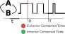
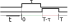

.. _finite_window:

.. currentmodule:: multi_locus_analysis.finite_window

Finite window correction
========================

Measurements of "waiting times" or "survival times" taken within a finite
time interval require special statistical treatment to account for the bias
towards short measurements introduced by the measurement itself. For
mathematical details, see the manuscript in preparation `(Beltran et. al.,
*in preparation*)
<https://www.overleaf.com/project/5c6c76d88d00f95294959995>`_.

Otherwise, the process for these corrections in explained in the
module's doctring

:mod:`multi_locus_analysis.finite_window`
-----------------------------------------
    .. automodule:: multi_locus_analysis.finite_window
        :noindex:

Tutorial
--------

Generating AB Trajectories
^^^^^^^^^^^^^^^^^^^^^^^^^^

We use the following functions to generate example data (for the case when the
means of the distribution are not known or hard to calculate, see the function
:func:`multi_locus_analysis.finite_window.ab_window`):

.. autofunction:: multi_locus_analysis.finite_window.ab_window_fast
    :noindex:

Here's an example of a so-called time-homogeneous process that switches between
states "exp(4,4)" and "exp(1,6)". We observe 1000 copies of the process for 20
time units.

.. plot::
    :nofigs:
    :context: close-figs

    >>> import scipy.stats
    >>> from multi_locus_analysis import finite_window as fw
    >>> e44 = scipy.stats.expon(scale=4, loc=4)
    >>> e16 = scipy.stats.expon(scale=6, loc=1)
    >>> trajs = fw.ab_window_fast([e44.rvs, e16.rvs], [e44.mean(), e16.mean()],
    >>>     window_size=20, num_replicates=10000, states=['exp(4,4)', 'exp(1,6)'])
    >>> trajs.head()
       replicate     state  start_time   end_time  window_start  window_end
    0          0  exp(1,6)   -3.327818   0.788432             0          20
    1          0  exp(4,4)    0.788432   6.865933             0          20
    2          0  exp(1,6)    6.865933  11.175979             0          20
    3          0  exp(4,4)   11.175979  17.382677             0          20
    4          0  exp(1,6)   17.382677  18.787130             0          20

From each trajectory, we can extract the wait times:

.. plot::
    :nofigs:
    :context:

    >>> waits = trajs.groupby('replicate').apply(fw.traj_to_waits)
    >>> waits.head()
                replicate     state  start_time   end_time  window_start  window_end  wait_time  window_size      wait_type
    rank_order
    0                   0  exp(1,6)    0.000000   0.788432             0          20   0.788432           20  left exterior
    1                   0  exp(4,4)    0.788432   6.865933             0          20   6.077500           20       interior
    2                   0  exp(1,6)    6.865933  11.175979             0          20   4.310046           20       interior
    3                   0  exp(4,4)   11.175979  17.382677             0          20   6.206698           20       interior
    4                   0  exp(1,6)   17.382677  18.787130             0          20   1.404453           20       interior

Rescaling Exact Waiting Times
^^^^^^^^^^^^^^^^^^^^^^^^^^^^^

Below, we plot three curves alongside each other. In black, we show the actual
distribution of "waiting time"s in state "exp(4,4)" from the simulation above.
In green is the empirical distribution function of the "interior times". If you
didn't have specific experience with lifetimes data, it might seem like one
could simply histogram the interior times in order to reproduce the actual
distribution (since you observed the whole waiting time). However, as you can
see, even if we only take "interior" times, the empirical CDF of the
data does not match the distribution that we put in (e.g. `expon(loc=4,
scale=4)` in this case, from above), even if we are extra generous and rescale
the CDFs to match at "t=window_size".

.. plot::
    :context:

    >>> # plot kaplan-meier estimate first, library creates new figure
    >>> import lifelines
    >>> waits44 = waits[waits['state'] == 'exp(4,4)']
    >>> kmf = lifelines.KaplanMeierFitter().fit(
    >>>     waits44['wait_time'].values,
    >>>     event_observed=(waits44['wait_type'] == 'interior').values,
    >>>     label='Meier-Kaplan Estimator, $\pm$95% conf int'
    >>> )
    >>> kmf.plot_cumulative_density()
    >>>
    >>> # plot actual distribution
    >>> t = np.linspace(0, 20, 100)
    >>> plt.plot(t, e44.cdf(t), 'k-.', label='Actual CDF, exp(4,4)')
    >>>
    >>> # now compute the empirical distribution of the "interior" times
    >>> interior_44 = waits.loc[
    >>>     (waits['state'] == 'exp(4,4)') & (waits['wait_type'] == 'interior'),
    >>>     'wait_time'
    >>> ].values
    >>> x44, cdf44 = fw.ecdf(interior_44, pad_left_at_x=0)
    >>> plt.plot(x44, cdf44*e44.cdf(x44[-1]), label='Empirical CDF, exp(4,4)')
    >>> # prettify the plot
    >>> plt.xlabel('t')
    >>> plt.ylabel(r'$P(\mathrm{wait} <= t)$')
    >>> plt.legend()

The classical solution to this problem is to use the "Kaplan-Meier" correction.
This is the blue line in the figure above, along with 95% (pointwise) confidence
intervals.  However, if the interval of observation is large enough that
multiple state changes can be observed in one trajectory, then the Kaplan-Meier
correction will under-correct, because there is negative autocorrelation between
"successful" observation of times within a given trajectory (i.e. if we observe
a long time, then we will be near to the end of our observation window, so the
next observation *must* be small). The Meier-Kaplan correction was designed to
work with right-censored data, but only with right-censored data where every
single observed wait time is perfectly independent.

In order to correctly reproduce the actual underlying distribution, we can apply
a more general correction using
:func:`multi_locus_analysis.finite_window.ecdf_windowed`.

.. plot::
    :context: close-figs

    >>> plt.figure(figsize=[4,3])
    >>> x, cdf = fw.ecdf_windowed(interior_44, 20)
    >>> plt.plot(x, cdf, label='Empirical CDF, state 1')
    >>> plt.plot(t, e44.cdf(t), 'k-.', label='Actual CDF')
    >>> plt.xlabel('t')
    >>> plt.ylabel(r'$P(\mathrm{wait} <= t)$')

As you can see, this still does not perfectly reproduce the distribution, but
the bias is effectively zero for quite a large amount of time. We plot the
probability distribution functions (using a gaussian kernal density estimator)
below, and compare it to the result of using the Meier-Kaplan corrector. Notice
that the Meier-Kaplan corrector mis-estimates the "slope" of the PDF in semilog
space (which would lead to a mis-estimate of the parameter of the distribution)
while our estimator has the correct slope for quite some time, and so a fit to
the PDF (correctly cut off where the variance in the estimator starts to
increase) would correctly estimate the parameters of the actual distribution.

.. plot::
    :context: close-figs

    >>> plt.figure(figsize=[4,3])
    >>> kernel = fw.smooth_pdf(x, cdf)
    >>> plt.plot(t, kernel(t), label='Gaussian KDE, exp(4,4)')
    >>> plt.plot(t, e44.pdf(t), 'k-.', label='Actual PDF')
    >>> plt.yscale('log')
    >>> plt.ylim([e44.pdf(20), 0.4])
    >>> plt.xlabel('t')
    >>> plt.ylabel(r'$P(\mathrm{wait} <= t)$')

.. plot::
    :context: close-figs

    >>> plt.figure(figsize=[4,3])
    >>> kcdf = kmf.cumulative_density_at_times(x)
    >>> kernel = fw.smooth_pdf(x, kcdf)
    >>> plt.plot(t, kernel(t), label='Meier-Kaplan + "Gaussian KDE"')
    >>> plt.plot(t, e44.pdf(t), 'k-.', label='Actual PDF')
    >>> plt.yscale('log')
    >>> plt.ylim([e44.pdf(20), 0.4])
    >>> plt.xlabel('t')
    >>> plt.ylabel(r'$P(\mathrm{wait} <= t)$')

Importantly, notice that we had to divide by the actual CDF at the maximum
measurable :math:`t` in order to get agreement. This is equivalent to
normalizing the actual CDF so that it reaches one at the end of the observation
interval.

The same procedure works for arbitrary collections of data measured with
potentially different window sizes::

    # TODO, insert plot here showing agreement with multiple window sizes

A Caveat for Discrete Movies
^^^^^^^^^^^^^^^^^^^^^^^^^^^^

While we would ideally have an exact measurement of when transitions between
`A` and `B` states happen, it is more often the case that we have a "movie" of
sorts: where we measure the state of the system at a fixed set of times.

This only provides us with upper and lower bounds for the actual waiting time
that we're trying to observe. For example, consider the trajectory depicted
below.

::

        A A A A A B B B B B B B A A A A B
        | - - - | - - - | - - - | - - - |  ...
        |                               |
    t = 0s      1s      2s      3s      4s

This trajectory, when measured at the discrete times shown, would look like

>>> pd.Series({0: 'A', 1: 'A', 2: 'B', 3: 'A', 4: 'B'}).head()
    0    A
    1    A
    2    B
    3    A
    4    B
    dtype: object

Naively, if you only had this movie in front of you with no knowledge of the
actual underlying state change times, it might seem to suggest that there was an
exterior-censored "A" of length 2, one each interior censored times of length 1,
and one exterior-censored "B" time of length 1. However, by looking at the true
trajctory above, we see that the first "A" wait was much shorter than 2s, and
the first "B" wait was much longer than 1s, whereas the last "A" wait just
happened to match up with our prediction of 1s.

Because our normalization factor depends non-linearly on the observed waiting
time, one might guess that simply using the "naive" times might cause bias. We
will show that this is the case by generating some artificial movies ourselves.

Generating Discrete Trajectories (Movies)
^^^^^^^^^^^^^^^^^^^^^^^^^^^^^^^^^^^^^^^^^

:mod:`multi_locus_analysis.finite_window` includes a convenience method for
generating "movies" from the output of the `AB_window*` functions.

.. autofunction:: state_changes_to_trajectory
    :noindex:

This function has an alias for convenience
(:func:`multi_locus_analysis.finite_window.traj_to_movie`).

>>> movies = trajs.groupby('replicate').apply(traj_to_movie,
times=np.linspace(0, 1, 10))
>>> movies.head()
t          0.0  0.5  1.0  1.5  2.0  2.5  3.0  3.5  4.0  4.5  5.0
replicate
0            0    0    1    1    1    1    0    0    0    1    1
1            0    1    1    1    1    1    1    1    1    1    1
2            1    1    1    1    0    1    1    1    0    1    1
3            0    0    1    1    1    1    1    1    1    1    0
4            0    0    0    1    1    1    1    1    1    1    0

We can get a long-form DataFrame by simply doing

>>> movies.T.unstack()
>>> movies.name = 'state' # name resulting column from unstack
>>> movies.head()
replicate  t
0          0.0    0
           0.5    0
           1.0    1
           1.5    1
           2.0    1
Name: state, dtype: int64

As is clear from the following plot, the data being effectively
discretized creates a bias in the tail of the distribution, even when the
times are corrected with our method.

.. TODO : finish

Theoretical Details
-------------------

The following section contains a complete derivation of the framework used to
generate the corrections used in this module.

Motivating (A)synchronicity
^^^^^^^^^^^^^^^^^^^^^^^^^^^

We first motivate our definition of "(a)synchronicity", the critical property
that allows us to correct for the effects of observing in a finite window.

Suppose a process starts at :math:`-t_\text{inf}` (WLOG, assume it starts in
state :math:`A`). For times after :math:`-t_\text{inf} \lll 0`, the process switches
between states :math:`A` and :math:`B`. The distribution of times spent in each
state before switching are IID, and distributed like :math:`f_A(t)` and
:math:`f_B(t)`, respectively. We then are able to observe the process during the
interval of time :math:`[0, T]`.

This can be thought of as a renewal(-reward) process that started far in the
past. As long as the starting point, :math:`-t_\text{inf}`, is sufficiently far
in the past, and the distributions :math:`f_*(t)` have finite variance, various
convenient properties hold true for the observed state switching times between
:math:`0` and :math:`T`. We use the same example as in the "tutorial" section in
what follows.

.. plot::
    :nofigs:
    :context: close-figs

    >>> import scipy.stats
    >>> from multi_locus_analysis import finite_window as fw
    >>> e44 = scipy.stats.expon(scale=4, loc=4)
    >>> e16 = scipy.stats.expon(scale=6, loc=1)
    >>> trajs = fw.ab_window([e44.rvs, e16.rvs], window_size=20, offset=-1000,
    >>>     num_replicates=10000, states=['exp(4,4)', 'exp(1,6)'])

The first convenient property is that the switching times are uniformly
distributed within the observation interval (as
:math:`-t_\text{inf}\to-\infty`). Intuitively, this just means that
:math:`-t_\text{inf}` is far enough in the past that, independently of the
distribution, we are not biased towards the switching times being early or late
in our observation interval (i.e. we have lost all memory of the "real" start
time).

.. plot::
    :context:

    >>> plt.figure(figsize=[4,3])
    >>> plt.hist(trajs['start_times'].values, 100)
    >>> plt.xlim([0, 20])
    >>> plt.xlabel('Rate of "creation of left ends"')

Now let's label the observed state switches as :math:`t_0,\ldots{},t_{n-1}`,
with :math:`t_0` and :math:`t_n` corresponding to the "actual" (unobserved)
state switch times flanking the observation interval.
The next useful property is that the start of the observation interval
(:math:`t=0`) is uniformly distributed within :math:`[t_0, t_1]` (similarly, the
end of the observation interval, :math:`t=T`, is uniformly distributed in
:math:`[t_{n-1}, t_n]`.

.. plot::
    :context: close-figs

    >>> plt.figure(figsize=[4,3])
    >>> t01 = trajs[trajs['start_time'] < 0]
    >>> u = -t01['start_time']/(t01['end_time'] - t01['start_time'])
    >>> plt.hist(u, 100)
    >>> plt.xlabel('Fraction of way between state changes at $t=0$.')

For the interior times, we can simply use the first fact to derive our interior
time correction. Since we know the starting times of each state are uniformly
distributed, we immediately can tell that if a waiting time of length
:math:`\tau` has a start time within the interval, then the the fraction of
times that this waiting time will end up being an interior time is just
:math:`(T - \tau)/T`. More precisely, we have that

.. math::

    P(t_{i+1} \leq T | t_{i+1}-t_i=\tau, t_i \in [0,T]) = \int_0^T 1_{t_i + \tau
    \leq T} f_{\text{Unif}[0,T]}(t_i) dt_i

which is just equal to :math:`(T - \tau)/T`.

This correction factor can be visualized easily as simply counting what fraction
of "start" times of a given length lead to "end" times still inside the
interval. Namely, it's the green part of the interval in the following diagram:

On the other hand, we have to be careful about the distribution of exterior
times, even if we do somehow magically have the values
of :math:`t_0` and the state at :math:`t=0`. You can't simply assume that
:math:`t_1 - t_0` is distributed like :math:`f_A(t)` or :math:`f_B(t)`. After
all, in fact it is distributed like :math:`tf_*(t)`. This is because (loosely
speaking) if you fill the real line with a bunch of intervals whose lengths are
distributed like :math:`f(t)`, then you choose a point on the real line at
random, you are more likely to land in an interval of size :math:`t` the longer
that :math:`t` is.

.. plot::
    :context: close-figs

    >>> plt.figure(figsize=[4,3])
    >>> a1 = t01[t01['state'] == 'exp(4,4)']
    >>> x, cdf = fw.ecdf(a1['end_time'] - a1['start_time'])
    >>> kernel = fw.smooth_pdf(x, cdf)
    >>> plt.plot(x, kernel(x), label=r'$\hat{f}(t)$: Observed CDF of $t_1 - t_0$')
    >>> plt.plot(x, e44.pdf(x), label=r'$f(t)$: Actual CDF of exp(4,4)')
    >>> Z = scipy.integrate.quad(lambda x: x*e44.pdf(x), 0, np.inf)
    >>> plt.plot(x, x*e44.pdf(x)/Z[0], label=r'$t f(t)/\int_0^\infty t f(t) dt$')
    >>> plt.legend()

(A)synchronicity
^^^^^^^^^^^^^^^^

While the explicit framework presented above is a useful tool, it is ill-defined
for heavy-tailed processes, in which we are primarily concerned when making
these types of corrections. In order to retain the useful properties of the
system that made it possible to derive the interior and exterior times
distributions, we simply notice that the *real* property that we want to be true
when measuring these systems is *asynchronicity*, or what a physicist might call
"symmetry under time translations" or "time homogeneity". In short, we want to
impose the constraint that we are only interested in scientific measurements
where changing the interval of observation :math:`[0, T]` to
:math:`[0+\tau,T+\tau]` for any :math:`\tau` will not change any properties of
the measurement.

.. note::

    We leave as an exercise to the reader to show that:

    1. the renewal process of the previous section is a special case of an asynchronous process
    2. this definition of asynchronicity produces all three properties we demonstrated for our renewal process above

On the other extreme from asynchronicity is the situation in which the
Meier-Kaplan correction was originally designed to be used. Namely, we could
imagine that a perfectly *synchronous* process is one where :math:`t_0` is fixed
to be at time :math:`t=0`, meaning that :math:`t_1 - t_0` is distributed as just
:math:`f_*(t)`.

While in principle anything between asynchrony and synchrony is possible, it is
true in general that almost all scientific measurements area already done using
either purely synchronous or asynchronous systems, since it is intuitively clear
that a lack of understanding of the synchronicity of one's system can lead to
uninterpretable results.

Laplace Formalism
^^^^^^^^^^^^^^^^^

