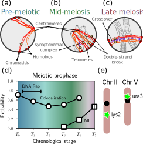

.. _homolog_example:

.. currentmodule:: multi_locus_analysis.examples.burgess

Analyzing homologous loci trajectories
======================================

In collaboration with the `Burgess lab
<https://smburgess.faculty.ucdavis.edu/>`_ at UC Davis, we have compiled an
example data set that involves measurements of pairs of homologous loci
diffusing throughout the nucleii of *S. cerevisiae* cells at different stages of
meiosis I.

In the following sections, we lay out the process of

1. extracting the nuclear radius, diffusivity, and other parameters from this
   kind of data.
2. analyzing the time it takes the loci to colocalize, and how long they stay
   colocalized.
3. comparing these results to analytical theory from the `wlcsim
   <wlcsim.rtfd.io>`_ module.

In order for our plots to have the same styling as in our paper, we first set
our matplotlib style:

.. plot::
    :nofigs:
    :context: close-figs

    >>> from multi_locus_analysis.examples.burgess.styles import *
    >>> use_pnas_style()

Description of the data
-----------------------

.. plot::
    :nofigs:
    :context:

    >>> from multi_locus_analysis.examples import burgess

Our study used yeast strains containing chromosomes carrying FROS tags,
comprised of chromosomally-integrated *tet* operator arrays of 112 repeats bound
by fluorescent TetR-GFP protein.  Operators were inserted at
either the *URA3* locus---which is on the short arm of chr.~V near the
centromere, or the *LYS2* locus---which is in the center of the long arm
of chr. |nbsp| II.

On the population level, these loci are known to start off largely colocalized at
the end of G0, then separate at the start of meiosis, before becoming
colocalized again during prophase |nbsp| I:

    A schematic of the relative timing of the chromosome events of meiosis in
    SK1 strains of budding yeast,
    :cite:`padmore1991,weiner1994,cha2000,tesse2003,brar2009,borner2004,peoples2002`.
    (a) Chromosomes in pre-meiotic cells arrested in G0 are in the Rabl
    configuration with centromeres tethered to the nuclear periphery. (b) Early
    to mid prophase is marked by DSB formation and the initiation of synapsis.
    (c) Late prophase is marked by the end-to-end alignment of homologs by the
    synaptonemal complex. (d) Fraction cells over time that demonstrate
    colocalization of the *URA3* locus and completion of meiosis I (MI). The
    x-axis measures the time :math:`T_i` (:math:`i` hours) after induction of
    sporulation that the cells in question were prepared for imaging.
    Pre-meiotic colocalization is lost during DNA replication and is restored
    during meiotic prophase, culminating in the full-length alignment of
    homologs joined by the synaptonemal complex (SC). Soon afterwards, cells
    begin to complete meiosis I (MI). (e) The relative positions along the
    chromosome of our tagged loci are shown. These loci were chosen to probe the
    dependence of colocalization on centromere proximity.

We wish to uncover what the forces are pulling these loci together. In order to
do so, we must first establish a baseline model for what the diffusion of these
loci would look like in the absense of any force.

Parameterization of Rouse model
-------------------------------

The Rouse model is the most basic possible model for a diffusing polymer, and
applies even to semiflexible polymers such as DNA at long enough length and
time scales (significantly longer than the persistence length).

Justification for the Kuhn length
^^^^^^^^^^^^^^^^^^^^^^^^^^^^^^^^^

TODO: copy in justifications for both 15nm and 50nm.

Determining nuclear radius
^^^^^^^^^^^^^^^^^^^^^^^^^^

The budding yeast nucleus is typically described as being a sphere with radius
of around :math:`1\mu{}m`, :cite:`phillips2012`. However, the nucleur size can
change drastically between strains :cite:`berger2008`, and between growth
conditions :cite:`jorgensen2007`. In addition, the nucleus grows two-fold, along with
the cell, between the G1 and S phases :cite:`jorgensen2007`.

In addition, the nucleus is almost never percisely spherical, however, recent
measurements have shown that the nucleus is typically approximately spherical
throughout the cell cycle (with a mild elongation at the start of mitosis) once
spherical abberations from the typical imaging setup are corrected for
:cite:`wang2016`. To our knowledge, no reliable measurements of this same type
exist for cells entering meiosis, so we will instead use the convex hull of the
volume explored by our tagged loci to estimate the nuclear radius (more
precisely, to set a lower bound on this radius).

.. plot::
    :context: close-figs

    >>> from multi_locus_analysis.stats import convex_hull
    >>> fig, ax = plt.subplots(constrained_layout=True, figsize=(col_width, golden_ratio*col_width))
    >>> chull_volume = burgess.df \
    >>>     .groupby(burgess.cell_cols) \
    >>>     .apply(convex_hull, xcol='X', ycol='Y', zcol='Z', volume=True)
    >>> volume_to_r = lambda V: np.power(3/4/np.pi*V, 1/3)
    >>> chull_volume.loc['HET5', 'WT', :, 't5'] \
    >>>             .apply(volume_to_r) \
    >>>             .hist(ax=ax)
    >>> ax.set_xlabel(r'Nuclear Radius ($\mu{}m$)')
    >>> ax.set_ylabel('Count')

Determining diffusivity
^^^^^^^^^^^^^^^^^^^^^^^

TODO: fit initial power-law slope of WT URA t3 to analytical theory to determine
D.

Example "cells"
---------------

Given all of these parameters, we can now use our model to visualize how
heterogeneity between individual cells affects the single-cell MSCD curves, and
compare that to what we see in the experiments. Consider the following example
cells:

.. plot::
    :context: close-figs

    >>> from multi_locus_analysis.examples.burgess import plotting as mplt
    >>> cells = [homolog.generate_poisson_homologs(4, burgess.chrv_size_bp)
    >>>          for i in range(5)]
    >>> mplt.draw_cells(cells)

.. plot::
    :context: close-figs

    >>> t = np.arange(30, 1501, 30)
    >>> plateaus = [homolog.mscd_plateau(links) for links in cells]
    >>> i = np.argsort(plateaus)
    >>> for i, cell in enumerate(cells):
    >>>     pass
    #TODO: change everything (draw_cells) to um

.. include:: determining-diffusivity.rst

Experimental waiting times
--------------------------

.. include:: experimental-waiting-times.rst

.. bibliography:: homologs.bib
