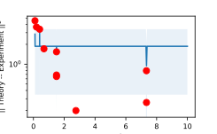

.. _homolog_example:

.. currentmodule:: multi_locus_analysis.examples.burgess

Analyzing homologous loci trajectories
======================================

In collaboration with the `Burgess lab
<https://smburgess.faculty.ucdavis.edu/>`_ at UC Davis, we have compiled an
example data set that involves measurements of pairs of homologous loci
diffusing throughout the nucleii of *S. cerevisiae* cells at different stages of
meiosis I.

In the following sections, we lay out the process of

1. extracting the nuclear radius, diffusivity, and other parameters from this
   kind of data.
2. analyzing the time it takes the loci to colocalize, and how long they stay
   colocalized.
3. comparing these results to analytical theory from the `wlcsim
   <wlcsim.rtfd.io>`_ module.

In order for our plots to have the same styling as in our paper, we first set
our matplotlib style, and import our data:

.. plot::
    :nofigs:
    :context: close-figs

    >>> from multi_locus_analysis.examples import burgess
    >>> from multi_locus_analysis.examples.burgess.styles import *
    >>> use_pnas_style()

Description of the data
-----------------------

Our study used yeast strains containing chromosomes carrying FROS tags,
comprised of chromosomally-integrated *tet* operator arrays of 112 repeats bound
by fluorescent TetR-GFP protein.  Operators were inserted at
either the *URA3* locus---which is on the short arm of chr.~V near the
centromere, or the *LYS2* locus---which is in the center of the long arm
of chr. |nbsp| II.

On the population level, these loci are known to start off largely colocalized at
the end of G0, then separate at the start of meiosis, before becoming
colocalized again during prophase |nbsp| I:

.. figure:: _static/homologs/Fig1.svg
    :alt: Figure showing (a) prophase stages, (b) colocalization progression, and (c) tagged locus genomic locations

    A schematic of the relative timing of the chromosome events of meiosis in
    SK1 strains of budding yeast,
    :cite:`padmore1991,weiner1994,cha2000,tesse2003,brar2009,borner2004,peoples2002`.
    (a) Chromosomes in pre-meiotic cells arrested in G0 are in the Rabl
    configuration with centromeres tethered to the nuclear periphery. (b) Early
    to mid prophase is marked by DSB formation and the initiation of synapsis.
    (c) Late prophase is marked by the end-to-end alignment of homologs by the
    synaptonemal complex. (d) Fraction cells over time that demonstrate
    colocalization of the *URA3* locus and completion of meiosis I (MI). The
    x-axis measures the time :math:`T_i` (:math:`i` hours) after induction of
    sporulation that the cells in question were prepared for imaging.
    Pre-meiotic colocalization is lost during DNA replication and is restored
    during meiotic prophase, culminating in the full-length alignment of
    homologs joined by the synaptonemal complex (SC). Soon afterwards, cells
    begin to complete meiosis I (MI). (e) The relative positions along the
    chromosome of our tagged loci are shown. These loci were chosen to probe the
    dependence of colocalization on centromere proximity.

We wish to uncover what the forces are pulling these loci together. In order to
do so, we must first establish a baseline model for what the diffusion of these
loci would look like in the absense of any force.

Confined Rouse polymer with linkages
------------------------------------

The Rouse model is the most basic possible model for a diffusing polymer, and
applies even to semiflexible polymers such as DNA at long enough length and
time scales (significantly longer than the persistence length).

TODO: describe the model more in detail, especially linkages, and relevant
parameters.

Running the Simulation
^^^^^^^^^^^^^^^^^^^^^^

The code used to run our simulations (including the final parameters chosen) can
be reproduced by running:

.. code:: bash

    >>> python -m multi_locus_analysis.examples.burgess.simulation

In short, this calls `~.simulation.run_homolog_param_scan`, which parallelizes
the running of `~.simulation.run_interior_sim` for various values of the mean
linkage density :math:`mu`. These calls are wrapped in the
`~.simulation.save_interior_sim` function to ensure that each individual
simulation is saved to its own sub-directory (making the parallelization
thread-safe, and even multi-node safe). The output of this command will be a
directory structure that looks like:

.. code:: bash

    >>> tree homolog-sim | head
    homolog-sim
    ├── params
    │   └── shared.csv
    ├── homolog-sim.tower13.1
    │   ├── all_beads.csv
    │   └── params.csv
    ├── homolog-sim.tower13.10
    │   ├── all_beads.csv
    │   └── params.csv
    .
    .
    .

where each folder is named ``"{base_name}/{base_name}.{hostname}.{i}"``, and the
code guarantees a unique folder name ``"{base_name}.{hostname}.{i}"`` per
simulation. The ``params.csv`` file holds the parameters that were passed to
`wlcsim.bd.homolog.rouse`, and the ``shared.csv`` file tabulates those
parameters that will be the same for all the replicates. You can rerun the
simulation script at any time to generate more replicates in the same
``"{base_name}"`` folder, and it will check ``shared.csv`` to ensure that you
are haven't changed any parameters between runs.

Each ``all_beads.csv`` file contains a Pandas dataframe, a representative
example might look like:

.. code:: python

    >>> all_beads.head()
        t  bead         X1   ...         Z2  is_loop  is_tether    FP
    0  0.0     0   0.000000  ...  23.677611        0          0  0.04
    1  0.0     1  -0.357303  ...  27.119501        0          0  0.04
    2  0.0     2 -14.284399  ...  12.135141        0          0  0.04
    3  0.0     3 -29.879801  ...  16.638270        0          0  0.04
    4  0.0     4 -71.418055  ... -61.567177        0          0  0.04

where ``'t'`` is the simulation time, ``'bead'`` is the bead index, ``'X{i}'``
is the :math:`x`-coordinate of polymer :math:`i` (since we're simulating
a homologous pair, :math:`i\in{1, 2}`), ``'is_loop'`` is true if that bead is a
linkage, ``'is_tether'`` is true if that bead is tethered to the nuclear
envelope, and ``'FP'`` is the fraction of beads that are linkages on average, in
this simulation run.

Processing simulation output
^^^^^^^^^^^^^^^^^^^^^^^^^^^^

In order to extract the relevant bits of the simulation output (i.e. the bead
closest to our experimental tag location, and simulation times that correspond
to those that we measured in our movies), the `burgess.simulation` module
provides quite a few convenience functions.

First, to collate just the bead we're interested in, we can pass the relevant
bead index to `~burgess.simulation.get_bead_df` to have it loop through all the
``all_beads.csv`` files to make an ``'all_bead_{i}.csv'`` file containing just
the positions at each time in the simulation of bead with index ``i``, with a
new column identifying which simulation folder the data is from:

.. code:: python

    >>> # warning, this can take several hours depending on hdd speed
    >>> df = simulation.get_bead_df(base_dir, bead_id=20)  # ura3
    >>> # or, if you've already run the above at least once...
    >>> # the output will have been automatically saved to this file
    >>> df = pd.read_csv(base_dir / Path('all_bead_20.csv')
    >>> df.head()
        FP              sim_name  bead         t         X1  ...  right_neighbor  min_bead  max_bead
    0  0.0  homolog-sim.tower0.0    20  0.000000  49.516035  ...             NaN         0       100
    1  0.0  homolog-sim.tower0.0    20  0.000025  70.466497  ...             NaN         0       100
    2  0.0  homolog-sim.tower0.0    20  0.000050  82.758519  ...             NaN         0       100
    3  0.0  homolog-sim.tower0.0    20  0.000076  93.888488  ...             NaN         0       100
    4  0.0  homolog-sim.tower0.0    20  0.000101  90.400716  ...             NaN         0       100
    >>> df.columns
    Index(['FP', 'sim_name', 'bead', 't', 'X1', 'Y1', 'Z1', 'X2', 'Y2', 'Z2',
        'is_loop', 'is_tether', 'left_neighbor', 'right_neighbor', 'min_bead',
        'max_bead'],
        dtype='object')

Notice that we've added some new information columns so that we don't have to go
and refer back to the original ``all_beads.csv`` file. ``left_neighbor`` and
``right_neighbor`` track the nearest linkage point to the left and right of the
bead of interest, respectively. ``min_bead`` and ``max_bead`` recall the length
of the polymer that was simulated (here, they typically are just a constant
value of ``0`` and ``num_beads-1``, respectively, across all simulations).

Finally, to get the positions of our bead of interest only at times that
correspond to the experiment, we can call `~burgess.simulation.select_exp_times`.

.. code:: python

    >>> df_exp = simulation.select_exp_times(df)
    >>> df_exp.head()
     FP               sim_name  bead   t  ...  max_bead
    0.0  homolog-sim.tower13.0    20   0  ...       100
    0.0  homolog-sim.tower13.0    20  30  ...       100
    0.0  homolog-sim.tower13.0    20  60  ...       100
    0.0  homolog-sim.tower13.0    20  90  ...       100

Notice that now only ``t`` that match the experimentally observed times of
`burgess.t_data`, i.e. ``np.arange(0, 1501, 30)``.

Parameterization of Rouse model
-------------------------------

Importing Raw Data
^^^^^^^^^^^^^^^^^^

First, we import the raw data from the examples module. For a complete
description of each column, see the documentation in
`.multi_locus_analysis.examples.burgess`.

.. code:: python

    >>> from multi_locus_analysis.examples import burgess
    >>> burgess.df[['X', 'Y', 'Z']].head()
    locus genotype exp.rep meiosis cell frame spot
    HET5  WT       2       t0      1    1     1     2.13328  3.19992  7.75
                                        2     1     2.53327  1.99995  7.75
                                        3     1     2.66660  2.39994  7.50
                                        4     1     2.79993  2.53327  7.50
                                        5     1     2.93326  2.39994  7.50

Justification for the Kuhn length
^^^^^^^^^^^^^^^^^^^^^^^^^^^^^^^^^

TODO: copy in justifications for both 15nm and 50nm.

Determining nuclear radius
^^^^^^^^^^^^^^^^^^^^^^^^^^

The budding yeast nucleus is typically described as being a sphere with radius
of around :math:`1\mu{}m`, :cite:`phillips2012`. However, the nucleur size can
change drastically between strains :cite:`berger2008`, and between growth
conditions :cite:`jorgensen2007`. In addition, the nucleus grows two-fold, along with
the cell, between the G1 and S phases :cite:`jorgensen2007`.

In addition, the nucleus is almost never percisely spherical, however, recent
measurements have shown that the nucleus is typically approximately spherical
throughout the cell cycle (with a mild elongation at the start of mitosis) once
spherical abberations from the typical imaging setup are corrected for
:cite:`wang2016`. To our knowledge, no reliable measurements of this same type
exist for cells entering meiosis, so we will instead use the convex hull of the
volume explored by our tagged loci to estimate the nuclear radius (more
precisely, to set a lower bound on this radius).

.. plot::
    :context: close-figs

    >>> from multi_locus_analysis.stats import convex_hull
    >>> fig, ax = plt.subplots(constrained_layout=True)
    >>> chull_volume = burgess.df \
    >>>     .groupby(burgess.cell_cols) \
    >>>     .apply(convex_hull, xcol='X', ycol='Y', zcol='Z', volume=True)
    >>> volume_to_r = lambda V: np.power(3/4/np.pi*V, 1/3)
    >>> chull_volume.loc['HET5', 'WT', :, 't5'] \
    >>>             .apply(volume_to_r) \
    >>>             .hist(ax=ax)
    >>> ax.set_xlabel(r'Nuclear Radius ($\mu{}m$)')
    >>> ax.set_ylabel('Count')

Phenomenological MSCD Correction
^^^^^^^^^^^^^^^^^^^^^^^^^^^^^^^^

Unlike in our analytical theory, in order to compute the MSCDs from our
experimental data, we must exclude all time points for which the distance
between the loci is less than 250nm, since below this resolution threshold we
cannot be certain how close together the two loci are.

While this skews our MSCDs to be larger than they actually are, we can show
using our simulation data that the bias is simply a constant multiplicative
factor, which we can then simply account for.

First, we define some simple code for plotting the mscds of our simulation
data:

.. code:: python

    import pandas as pd
    import multi_locus_analysis as mla
    import numpy as np
    import matplotlib.pyplot as plt
    from multi_locus_analysis.examples.burgess.styles import (sim_cmap,
        sim_cnorm_continuous)
    def plot_mscd(df):
        df = df.reset_index()
        fp = df['FP'].iloc[0]*100
        df = df.sort_values('delta')
        df = df[df['delta'] > 0]
        plt.errorbar(df['delta'], df['mean'], df['std']/np.sqrt(df['count']), c=sim_cmap(sim_cnorm_continuous(fp)))

Now we load in the simulation data:

.. code:: python

    df_exp = pd.read_csv('_static/homologs/bead_20_exp.csv'))
    df_exp = simulation.add_paired_cols(df_exp)

We compute the "real" MSCDs first:

.. code:: python

    all_dvel = df.groupby(['FP', 'sim_name']).apply(mla.stats.pos_to_all_vel,
        xcol='dX', ycol='dY', zcol='dZ', framecol='t')
    dV = (all_dvel['vx']**2 + all_dvel['vy']**2 + all_dvel['vz']**2)
    mscd_fp = dV.groupby(['FP', 'delta']).agg(['mean', 'std', 'count'])

they look like:

.. code:: python

    mscd_fp.groupby(['FP']).apply(plot_mscd)
    plt.yscale('log')
    plt.xscale('log')
    cb = plt.colorbar(sim_sm_continuous)
    cb.set_label('Linkages per chromosome')
    plt.xlabel('time (s)')
    plt.ylabel('Ensemble MSCD ($\mu{}m^2$)')
    plt.savefig(_static_dir / 'SuppFig_MSCD-correction_a.svg')

Then we can compute the MSCDs again, giving the simulation the same treatment
that our experimental data gets:

.. code:: python

    all_dvel_skipna = df[~df['pair250']] \
        .groupby(['FP', 'sim_name']) \
        .apply(mla.stats.pos_to_all_vel,
               xcol='dX', ycol='dY', zcol='dZ', framecol='t')
    dV_skipna = all_dvel_skipna['vx']**2 + all_dvel_skipna['vy']**2 \
        + all_dvel_skipna['vz']**2
    mscd_fp_skip_na = dV_skipna.groupby(['FP', 'delta']) \
                               .agg(['mean', 'std', 'count'])

they do in fact look like rescaled versions of each other, and we can check
this directly by dividing one by the other:

.. code:: python

    for fp, data in mscd_fp_skip_na.groupby('FP'):
        (data['mean'] / mscd_fp.loc[fp]['mean']).plot(
            c=sim_cmap(sim_cnorm_continuous(100*fp)))
        cb = plt.colorbar(sim_sm_continuous)
        cb.set_label('Linkages per chromosome')
        plt.yscale('log')
        plt.xscale('log')
        plt.xlabel('time (s)')
        plt.ylabel('Ratio')

The multiplicative factor can be found by averaging these curves. Here, we only
average the parts of the curve that are least likely to suffer from other
systematic bias due to the fact that we extract the MSCDs via a procedure that
includes time-averaging. It turns out that the multiplicative factor follows a
very nice power law:

.. code:: python

    >>> import scipy
    >>> def get_plateau(df):
    >>>     df = df.reset_index()
    >>>     return df[(df['delta'] > 250) & (df['delta'] < 650)]['mean'].mean()
    >>> plateau_actual = mscd_fp.groupby(['FP']).apply(get_plateau)
    >>> plateau_skipna = mscd_fp_skip_na.groupby(['FP']).apply(get_plateau)
    >>> slope, intercept, rvalue, pvalue, stderr = \
    >>>     scipy.stats.linregress(np.log10(plateau_actual), np.log10(plateau_skipna))
    >>> print(f'slope={slope}, intercept={intercept}')
    slope=0.6871366517395089, intercept=2.1876785072363103

We can visualize this power law as follows:

.. code:: python

    plt.scatter(plateau_actual, plateau_skipna)
    plt.yscale('log')
    plt.xscale('log')
    xlim = plt.xlim()
    plt.plot([0, 10e6], [0, 10e6], 'k.-')
    plt.plot(xlim, 10**(slope*np.array(np.log10(xlim)) + intercept), 'g.-')
    plt.xlim(xlim)
    plt.xlabel('Actual Plateau (nm$^2$)')
    plt.ylabel('Plateau from Unpaired Loci (nm$^2$)')

    The green line is the power law fit. The black line is :math:`y=x`.

Determining linkage density
^^^^^^^^^^^^^^^^^^^^^^^^^^^

With this quantitative correction factor in hand, and knowledge of the nuclear
radius (the other source of confinement), we can now use the confinement levels
of the ensemble average MSCD curves to extract the mean linkage density along
the chromosome for each of our time points.

First, we must extract the plateau levels (printed in :math:`\mu{}m^2`):

.. code:: python

    >>> locus = 'URA3'
    >>> strains_for_plateau = [(locus, 'WT'), (locus, 'SP')]
    >>> msds_file = burgess.burgess_dir / Path('msds_dvel_unp.csv')
    >>> if not msds_file.exists():
    >>>     burgess.msds.precompute_msds()
    >>> mscds = pd.read_csv(msds_file) \
    >>>         .set_index(['locus', 'genotype', 'meiosis'])
    >>> def average_end_times(df):
    >>>     return np.mean(df.loc[df['delta'] > 800, 'mean'])
    >>> plateaus = pd.DataFrame(index=[f't{i}' for i in range(7)])
    >>> for strain in strains_for_plateau:
    >>>     d = mscds.loc[strain]
    >>>     averages = d.groupby('meiosis').apply(average_end_times)
    >>>     plateaus[strain] = averages.loc['t0':'t6']
    >>> plateaus.head()
        (URA3, WT)  (URA3, SP)
    t0    0.906255    0.866363
    t1    1.106019    1.020559
    t2    1.276101    1.175226
    t3    1.266145    1.303145
    t4    1.173193    1.315637

we then need to generate the mapping between the average linkage density
:math:`\mu` and the expected MSCD plateau value from our analytical theory

.. code:: python

    mus = np.linspace(0, 10, 100)
    theory_plateaus = np.zeros_like(mus)
    N_cells = 10000
    for i, mu in enumerate(mus):
        for j in range(N_cells):
            theory_plateaus[i] += (1/N_cells) * homolog.mscd_plateau(
                homolog.generate_poisson_homologs(mu, chr_size=burgess.chrv_size_effective_um),
                label_loc=burgess.location_ura_effective_um,
                chr_size=burgess.chrv_size_effective_um,
                nuc_radius=burgess.nuc_radius_um, b=burgess.kuhn_length_nuc_chain
            )

Then, we can apply our phenomenological correction for the experimental MSCD
computation:

.. code:: python

    slope = 0.686798088540447
    intercept = 2.189713913621381
    theory_plateaus_nm = theory_plateaus * 1000**2
    plateau_observed_nm = 10**(slope*np.log10(theory_plateaus_nm) + intercept)
    plateau_observed = plateau_observed_nm / 1000**2
    plt.scatter(mus, plateau_observed)
    plt.xlabel('Average linkages per chromosome')
    plt.ylabel('Observed MSCD plateau ($\mu{}m^2$)')

Allowing us to extract estimates for the number of linkages per chromosome:

.. code:: python

    >>> fit_mus = plateaus.applymap(lambda p:
    >>>     np.interp(p, plateau_observed[::-1], mus[::-1]))
        ('URA3', 'WT')  ('URA3', 'SP')
    t0        2.568580        2.661584
    t1        2.023971        2.225883
    t2        1.712329        1.881599
    t3        1.727523        1.669743
    t4        1.885805        1.650072
    t5        2.476930        1.962244
    t6             NaN        1.705559

Repeating the same exercise with the alternative set of parameters that
correspond to bare DNA instead of a nucleosome chain results in a separate set
of estimates:

.. code:: python

    >>> wlc_fit_mus
        ('URA3', 'WT')  ('URA3', 'SP')
    t0       42.518713       45.592926
    t1       31.632718       35.980398
    t2       25.149340       28.886685
    t3       26.037688       24.398155
    t4       28.973497       23.958810
    t5       40.102647       30.355243
    t6             NaN       25.068711

Determining diffusivity
^^^^^^^^^^^^^^^^^^^^^^^

Now that we have estimates for the Kuhn length of the polymer, its total length,
and the average radius of the nucleus, all of the relevant length scales of the
problem are fixed.

It would be difficult to extract any relevant time scales from the single-cell
trajectories, since they are largely plateaus even at the shortest time scales
of our experiment (:math:`t = 30s`). Therefore, in order to determine the time
scale, we can look to the ensemble averaged MSCD curves.

Since we've now determined the mean linkage density for each time point, we can
simply compute an ensemble average of our analytical MSCD curves to correspond
to the ensemble average measurement, and fit the single parameter ``D`` to set
the appropriate time scale. first, we load the data, and define an objective
function that seeks to minimize the :math:`L^2` error between our analytical
result and the experiment.

.. code:: python

    # load in experimental data
    msds_file = burgess.burgess_dir / Path('msds_dvel_unp.csv')
    if not msds_file.exists():
        burgess.msds.precompute_msds()
    mscds = pd.read_csv(msds_file) \
            .set_index(['locus', 'genotype', 'meiosis'])
    # fit just against t3
    mscd_ura_t3 = mscds.loc['URA3', 'WT', 't3'].sort_values('delta')
    # from the plateaus array defined above
    plateau = plateaus[('URA3', 'WT')]['t3']
    # and the results of fitting mu with nuc_chain parameters
    mu = fit_mus[('URA3', 'WT')]['t3']
    t_data = burgess.t_data[:-1]  # mscd 'delta' only up to 1470
    def compare_to_ura3(logD, N_cells=1000):
        D = 10**logD
        theory_mscds = np.zeros_like(t_data)
        for j in range(N_cells):
            theory_mscds += (1/N_cells) * homolog.mscd(
                t_data,
                homolog.generate_poisson_homologs(mu, chr_size=burgess.chrv_size_nuc_chain_um),
                label_loc=burgess.location_ura_nuc_chain_um,
                chr_size=burgess.chrv_size_nuc_chain_um,
                nuc_radius=burgess.nuc_radius_um, b=burgess.kuhn_length_nuc_chain,
                D=D*np.random.exponential()
            )
        theory_mscds = theory_mscds/theory_mscds[-1]*plateau
        return -np.linalg.norm(theory_mscds - mscd_ura_t3['mean'])

Now, we can perform optimization. Due to noisiness of the data, Gaussian
Process-based optimization works the best:

.. code:: python

    >>> from bayes_opt import BayesianOptimization
    >>> # Bounded region of parameter space
    >>> pbounds = {'logD': (-1, 1)}
    >>> optimizer = BayesianOptimization(
    >>>     f=compare_to_ura3,
    >>>     pbounds=pbounds,
    >>>     random_state=1,
    >>> )
    >>> optimizer.maximize(
    >>>     init_points=5,
    >>>     n_iter=5,
    >>> )
    |   iter    |  target   |   logD    |
    -------------------------------------
    |  1        | -0.9102   | -0.166    |
    |  2        | -0.3911   |  0.4406   |
    |  3        | -2.313    | -0.9998   |
    |  4        | -1.647    | -0.3953   |
    |  5        | -1.857    | -0.7065   |
    |  6        | -0.2305   |  0.9042   |
    |  7        | -0.8142   |  0.1631   |
    |  8        | -0.8154   |  0.1631   |
    |  9        | -0.1691   |  0.69     |
    |  10       | -0.2272   |  1.0      |
    =====================================

We can plot the output of this optimization procedure:

.. code:: python

    def plot_bayes_opt(optimizer):
        x = np.linspace(-1, 1, 1000)
        mean, sigma = optimizer._gp.predict(x.reshape(-1, 1), return_std=True)
        plt.plot(10**x, mean)
        plt.fill_between(10**x, mean + sigma, mean - sigma, alpha=0.1)
        plt.scatter(10**optimizer.space.params.flatten(), optimizer.space.target, c="red", s=50, zorder=10)
        plt.xlabel('D ($\mu{}m^2$)')
        plt.ylabel('$-||$ Theory -- Experiment $||^2$')
    plot_bayes_opt(optimizer)

Then we can run a few more random steps in the vicinity of the best point to get
a really good value:

.. code:: python

    >>> optimizer.set_bounds(new_bounds={'logD': [np.log10(2), np.log10(4)]})
    >>> optimizer.maximize(
    >>>     init_points=10,
    >>>     #     n_iter=5,
    >>>     )
    |   iter    |  target   |   logD    |
    -------------------------------------
    |  21       | -0.2238   |  0.4838   |
    |  22       | -0.1486   |  0.537    |
    |  23       | -0.2712   |  0.4409   |
    |  24       | -0.2372   |  0.5756   |
    |  25       | -0.3245   |  0.4055   |
    |  26       | -0.2692   |  0.444    |
    |  27       | -0.1219   |  0.5425   |
    |  28       | -0.2419   |  0.5696   |
    |  29       | -0.2531   |  0.5269   |
    |  30       | -0.2056   |  0.4961   |
    =====================================

Finally, let's compare the MSCD we've calculated to the one we're fitting
against:

.. code:: python

    D = 10**optimizer.max['params']['logD']  # ~3.4
    theory_mscds = np.zeros_like(t_data)
    for j in range(N_cells):
        theory_mscds += (1/N_cells) * homolog.mscd(
            t_data,
            homolog.generate_poisson_homologs(mu, chr_size=burgess.chrv_size_nuc_chain_um),
            label_loc=burgess.location_ura_nuc_chain_um,
            chr_size=burgess.chrv_size_nuc_chain_um,
            nuc_radius=burgess.nuc_radius_um, b=burgess.kuhn_length_nuc_chain,
            D=D*np.random.exponential()
        )
    theory_mscds = theory_mscds/theory_mscds[-1]*plateau
    plt.loglog(mscd_ura_t3['delta'], mscd_ura_t3['mean'])
    plt.loglog(t_data, theory_mscds, 'k--')
    plt.xlabel('t (s)')
    plt.ylabel('MSCD ($\mu{}m^2$)')

Example "cells"
---------------

Given all of these parameters, we can now use our model to visualize how
heterogeneity between individual cells affects the single-cell MSCD curves, and
compare that to what we see in the experiments. Consider the following example
cells:

.. plot::
    :context: close-figs

    >>> from wlcsim.analytical import homolog
    >>> from multi_locus_analysis.examples.burgess import plotting as mplt
    >>> cells = [homolog.generate_poisson_homologs(4, burgess.chrv_size_bp)
    >>>          for i in range(5)]
    >>> mplt.draw_cells(cells)

Waiting time distributions
--------------------------

Extracting simulation wait times
^^^^^^^^^^^^^^^^^^^^^^^^^^^^^^^^

`.burgess.simulation` has helper functions for quickly extracting
experiment-like waiting times. We first load the single-bead simulation data we
created above:

.. code:: python

    >>> df_exp = pd.read_csv('bead_20_exp.csv')
    >>> df_exp = simulation.add_paired_cols(df_exp)
    >>> sim_waits = df.groupby(['FP', 'sim_name']).apply(
    >>>     fw.discrete_trajectory_to_wait_times,
    >>>     t_col='t', state_col='pair0.25'
    >>> )
    >>> sim_waits.head()
                                            start_time  end_time  wait_time  wait_state  min_waits  max_waits wait_type  window_size
    FP  sim_name                rank_order
    0.0 homolog-sim.tower13.100 1                  570       600         30        True          0         60  interior         1500
        homolog-sim.tower13.115 1                   30        60         30       False          0         60  interior         1500
                                2                   60        90         30        True          0         60  interior         1500
                                3                   90      1440       1350       False       1320       1380  interior         1500
                                4                 1440      1470         30        True          0         60  interior         1500

Since we used the ``pair0.25`` column to compute the wait times, then
``wait_state`` will be ``True`` if the wait time corresponds to a "residence
time" (aka "time spent paired" or "paired time" or "time spent colocalized") and
``False`` if it corresponds to a "search time" (aka "time spend unpaired" or
"unpaired time" or "time spent apart").

Extracting experimental wait times
^^^^^^^^^^^^^^^^^^^^^^^^^^^^^^^^^^

Similarly, we can extract the analogous wait times from our experimental data,
which come with a ``'foci'`` column that tells us whether they are colocalized
at a given time point.

.. code:: python

    >>> waitdf = df_flat \
    >>>     .groupby(burgess.cell_cols + ['na_id']) \
    >>>     .apply(mla.finite_window.discrete_trajectory_to_wait_times,
    >>>            t_col='t', state_col='foci')
    >>> waitdf.dropna(inplace=True) # get rid of NaN waits (buggy window sizes)
    >>> pair_df = waitdf[(waitdf['wait_type'] == 'interior') & waitdf['wait_state']]
    >>> unpair_df = waitdf[(waitdf['wait_type'] == 'interior') & ~waitdf['wait_state']]

.. bibliography:: homologs.bib
